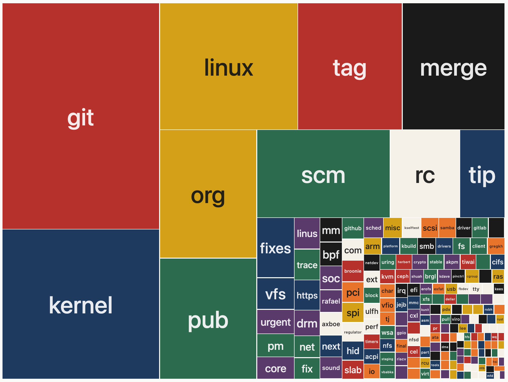

# Commit Halley

See which words you actually use in your commit messages.

[Live demo](https://paintingstack.github.io/commit-halley) -- loads with Torvalds' commits by default.

## How it works

Enter a GitHub username. Commit Halley searches all public commits by that user across every repo on GitHub, counts word frequencies, and renders them as colored tiles. Bigger tile, more frequent word.

Click any tile to see every commit containing that word, with links to the commit and repo on GitHub.

Share any chart via URL: `?user=username`.

Common stop words (the, a, and, is...) are excluded. The full list is visible at the bottom of the page.

## Tech

Static site. No framework, no build step, no backend.

- `index.html`, `style.css`, `script.js`
- D3.js (CDN) for the treemap layout
- GitHub Search Commits API called client-side from the browser
- GitHub Pages for hosting
- Up to 1,000 most recent commits per user

## License

MIT
